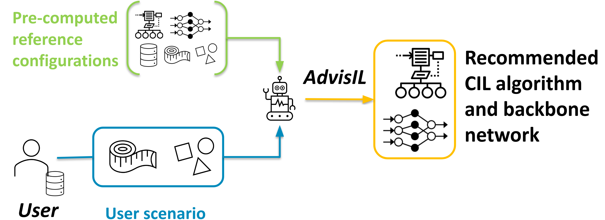

# AdvisIL
Repository for AdvisIL - A Class-Incremental Learning Advisor (WACV2023)

In this repository, we share the code for reproducing the results of our article "AdvisIL - A Class-Incremental Learning Advisor" and for contributing to the set of reference experiments used by AdvisIL's recommender system.

**Abstract**
> Recent class-incremental learning methods combine deep neural architectures and learning algorithms to handle streaming data under memory and computational constraints. The performance of existing methods varies depending on the characteristics of the incremental process. To date, there is no other approach than to test all pairs of learning algorithms and neural architectures on the training data available at the start of the learning process to select a suited algorithm-architecture combination. 
To tackle this problem, in this article, we introduce AdvisIL, a method which takes as input the main characteristics of the incremental process (memory budget for the deep model, initial number of classes, size of incremental steps) and recommends an adapted pair of learning algorithm and neural architecture. The recommendation is based on a similarity between the user-provided settings and a large set of pre-computed experiments.
AdvisIL makes class-incremental learning easier, since users do not need to run cumbersome experiments to design their system.  
We evaluate our method on four datasets under six incremental settings and three deep model sizes. We compare six algorithms and three deep neural architectures. Results show that AdvisIL has better overall performance than any of the individual combinations of a learning algorithm and a neural architecture.

**How to cite :** 
Feillet Eva, Petit Gégoire, Popescu Adrian, Reyboz Marina, Hudelot Céline, "AdvisIL - A Class-Incremental Learning Advisor", _Winter Conference on Applications of Computer Vision_, January 2023, Waikoloa, USA. 
_____

**Content of this repository**

* AdvisIL TODO changer nom --> configs_utils
* build_datasets : copier dossier clean local, comment obtenir les splits ImageNet + fournir les listes de fichiers dans un autre dossier image_list_files
* ajouter image_list_files/train100 + ma version locale pour les subsets imagenet
* deesil : vérifier contenu, lister les choses à conserver ou pas
* hp_tuning
* LUCIR
* LwF : ne pas conserver
* MobIL : maj ? --> pointer vers nouveau repo FeTrIL
* parsing : ?
* reco : modifier avec code Adrian
* scaling : ?
* siw
* SPBM : TODO modif learning rate cf Slack

* add a requirements file --> py37 env OK
* image_list_files > train100

à terme
* model_utils et code backbones --> créer un dossier models
* DSLDA : à rajouter
* virer fichiers scaler, scaling et tutorial.
* modifier tous les noms de chemins
* traquer les éléments hard codés, mettre en paramètres les chemins et autres noms.
* captions folder --> image principe advisil

_____

## Tutorial 

### 0. Requirements

We use Python deep learning framework PyTorch (`Python version 3.7`, `torch version 1.7.1+cu110`) in association with cuda (`CUDA Version: 11.4`).

In a future release, we plan to integrate our code with Avalanche continual learning library. The packages used in this repository are compatible with the current version of Avalanche and ray[tune].

To start with, we advise you to create a virtual environment dedicated to this project with conda. You can use the requirements file `requirements_py37.txt`, or alternatively the explicit `py37_requirements_linux64.txt` if you have a Linux distribution.

> conda create --name py37 --file requirements_py37.txt

To use this environment : 

> conda activate py37

### 1. Get the datasets

1. ImageNet subsets : 

**Prerequisite** : access to ImageNet 21K full database.

For each subset, run the following commands to get the images in a dedicated folder, and to compute the mean and standard deviation of the colour channels.  

* RANDOM0 subset

> python AdvisIL/imagenet/build_datasets/imagenet_random_subsetter.py AdvisIL/imagenet/build_datasets/imagenet_random_subsetter0.cf

> python /home/users/efeillet/images_list_files/compute_dataset_mean_from_images_list.py /home/users/efeillet/images_list_files/train100/imagenet_random_0/train.lst 

* RANDOM1 subset

> python AdvisIL/imagenet/build_datasets/imagenet_random_subsetter.py AdvisIL/imagenet/build_datasets/imagenet_random_subsetter1.cf

> python /home/users/efeillet/images_list_files/compute_dataset_mean_from_images_list.py /home/users/efeillet/images_list_files/train100/imagenet_random_1/train.lst 

* RANDOM2 subset

> python AdvisIL/imagenet/build_datasets/imagenet_random_subsetter.py AdvisIL/imagenet/build_datasets/imagenet_random_subsetter2.cf

> python /home/users/efeillet/images_list_files/compute_dataset_mean_from_images_list.py /home/users/efeillet/images_list_files/train100/imagenet_random_2/train.lst

* FLORA subset

> python AdvisIL/imagenet/build_datasets/imagenet_subsetter.py AdvisIL/imagenet/build_datasets/imagenet_subsetter_flora.cf

> python /home/users/efeillet/images_list_files/compute_dataset_mean_from_images_list.py /home/users/efeillet/images_list_files/train100/imagenet_flora/train.lst 

* FAUNA subset

> python AdvisIL/imagenet/build_datasets/imagenet_subsetter.py AdvisIL/imagenet/build_datasets/imagenet_subsetter_fauna.cf

> python /home/users/efeillet/images_list_files/compute_dataset_mean_from_images_list.py /home/users/efeillet/images_list_files/train100/imagenet_fauna/train.lst & wait

* FOOD subset

> python AdvisIL/imagenet/build_datasets/imagenet_subsetter.py AdvisIL/imagenet/build_datasets/imagenet_subsetter_food.cf

> python /home/users/efeillet/images_list_files/compute_dataset_mean_from_images_list.py /home/users/efeillet/images_list_files/train100/imagenet_food/train.lst 

Sanity check : you must obtain the same means and standard deviations as in `./images_list_files/datasets_mean_std.txt` . 

**Optional** : Create your own ImageNet subset : see dedicated [tutorial](./imagenet/tutorial.md).

2. Other datasets

Quelle version ? inclure lien téléchargement

* Food101
* Google Landmarks
* iNaturalist

### Test runs on reference datasets /EXPE/

See launchers in /home/users/efeillet/expe/AdvisIL/ref.

### Architecture exploration

> python scaler.py

or

> sbatch /home/users/efeillet/expe/misc/launcher.sh

### Hyperparameter tuning 

NB : You need to download ray-tune.

> pip install -U "ray[tune]"  # installs Ray + dependencies for Ray Tune

Test the code

> sbatch /home/users/efeillet/incremental-scaler/hp_tuning/launsher_hp_tuner.sh 

Specific backbones

> python /home/users/efeillet/incremental-scaler/hp_tuning/hp_tuner.py /home/users/efeillet/incremental-scaler/hp_tuning/hp_tuner_mobilenet.cf

> python /home/users/efeillet/incremental-scaler/hp_tuning/hp_tuner.py /home/users/efeillet/incremental-scaler/hp_tuning/hp_tuner_resnet.cf

> python /home/users/efeillet/incremental-scaler/hp_tuning/hp_tuner.py /home/users/efeillet/incremental-scaler/hp_tuning/hp_tuner_shufflenet.cf

More hyperparameter tuning experiments

> sbatch /home/users/efeillet/expe/AdvisIL/hp_tuning/launsher_hp_tuner_1.sh

Similarily, launch launsher_hp_tuner_2.sh and launsher_hp_tuner_3.sh.

Collect & Analyse results

> python /home/users/efeillet/incremental-scaler/hp_tuning/tuning_analyser.py

### Scaling experiments

NB : here we use LUCIR for scaling experiments. Similar guidelines apply for other methods.

1. Define settings --> output yaml files

> python /home/users/efeillet/incremental-scaler/scaling/scaling_yaml_writer.py

2. Build config files, folder structure and launcher files

First, set paths in config_writer.cf, in particular the path to your input yaml file and the path to your output config and launcher files.

> python /home/users/efeillet/incremental-scaler/LUCIR/codes/config_writer.py /home/users/efeillet/incremental-scaler/LUCIR/configs/config_writer.cf

3. Run experiments using the launcher files

Recommended : split the experiments across several launcher files (manually), depending on your available computing resources and on the number of trials you wish to run for each particular experimental setting. Don't forget to give the jobs different names so that you can cancel them individually if needed. Also take great care in naming the log and error files so that they are easily findable and don't confilct with each other. See example below. 

> /home/data/efeillet/expe/scaling/imagenet_fauna/imagenet_fauna_lucir_equi_s10/unique/LUCIR/u_launcher_LUCIR_1.sh

4. Parse log files

Again, pay attention to the name of your output files so that you do not erase previous files incidentally by running the script on different data but with the same output name.

> python /home/users/efeillet/incremental-scaler/scaling/log_parser.py /home/users/efeillet/incremental-scaler/scaling/log_parser.cf

5. Plot results

Plot initial accuracies

> python /home/users/efeillet/incremental-scaler/scaling/RFIAP_plots.py

Plot average incremental accuracy

> python /home/users/efeillet/incremental-scaler/scaling/log_parser_init.py /home/users/efeillet/incremental-scaler/scaling/log_parser_init.cf

> python /home/users/efeillet/incremental-scaler/scaling/RFIAP_plots_init.py

### Running Incremental Learning Methods

#### DeeSIL --> see dedicated repo

#### DSLDA 

#### LUCIR & SPB-M

> python /home/users/efeillet/incremental-scaler/LUCIR/codes/main.py /home/users/efeillet/incremental-scaler/LUCIR/configs/LUCIR.cf

> python /home/users/efeillet/incremental-scaler/SPBM/codes/main.py /home/users/efeillet/incremental-scaler/SPBM/configs/LUCIR.cf

#### SIW

First batch
> python /home/users/efeillet/incremental-scaler/siw/FT/codes/scratch.py /home/users/efeillet/incremental-scaler/siw/FT/configs/scratch.cf

Fine-tuning without memory
> python /home/users/efeillet/incremental-scaler/siw/FT/codes/no_mem_ft.py /home/users/efeillet/incremental-scaler/siw/FT/configs/no_mem_ft.cf

Feature extraction
> python /home/users/efeillet/incremental-scaler/siw/FT/codes/features_extraction.py /home/users/efeillet/incremental-scaler/siw/FT/configs/features_extraction.cf

Weight correction using standardization of initial weights
> python /home/users/efeillet/incremental-scaler/siw/FT/codes/inFT_siw.py /home/users/efeillet/incremental-scaler/siw/FT/configs/inFT_siw.cf

### Computing AdvisIL reference experiments using reference scenarios

1. Generate yaml files with your hyperparameters for each backbone type

NB : hyperparameters for the first batch were obtained by tuning. Hyperparameters for incremental states are more generic. 

Don't forget to modify the source and destination folders in the config files. You may store all yaml files in the same folder since a filtering step is applied on yaml filename (what algorithm name do they contain) prior to config file generation (next step).

Reference points

> python /home/users/efeillet/incremental-scaler/AdvisIL/yaml_writer.py

Test points

> python /home/users/efeillet/incremental-scaler/AdvisIL/yaml_writer_testsets.py

For debugging purposes, use this version that creates quicker experiments : 

> python /home/users/efeillet/incremental-scaler/AdvisIL/yaml_writer_test.py

2. Generate folders, config files and launcher files for each method

> python /home/users/efeillet/incremental-scaler/AdvisIL/config_writer_lucir.py /home/users/efeillet/incremental-scaler/AdvisIL/config_writer_lucir.cf

> python /home/users/efeillet/incremental-scaler/AdvisIL/config_writer_spbm.py /home/users/efeillet/incremental-scaler/AdvisIL/config_writer_spbm.cf

> python /home/users/efeillet/incremental-scaler/AdvisIL/config_writer_siw.py /home/users/efeillet/incremental-scaler/AdvisIL/config_writer_siw.cf

Do the same thing for test experiments. 

3. Split or group experiments across launchers (manually) and run them

A typical arborescence is the following : TO ADD (screenshot ?)

4. Parse log files and save results in a structured format

#### Computing AdvisIL recommendations for reference scenarios

#### Computing AdvisIL recommendations for test scenarios

### Visualizations
